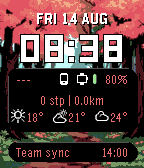
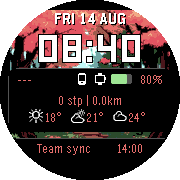
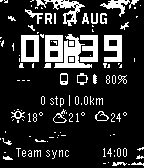

# Pixel8

> **Heads-up:** this project is built entirely with [Claude Code](https://claude.com/claude-code)
> by someone who can't code. I describe what I want on my watch; Claude writes the
> code. Read, reuse, and judge the source with that in mind.

A feature-rich watchface built around full-screen pixel-art wallpapers with
floating 3D info cards. Runs on every Pebble platform: Pebble Time 2 (emery),
Pebble Time / Time Steel (basalt), Pebble Time Round (chalk), Pebble 2 (diorite),
the original Pebble / Pebble Steel (aplite), and the newer Rebble-made flint
and gabbro.

Developed and daily-driven on a Pebble Time 2 — that's the platform with real
hardware testing. The other six platforms were added and verified in the
Pebble SDK emulator only (no other physical devices on hand); see
[Architecture notes](#architecture-notes) below for how.

[**Get it on the Rebble store**](https://apps.rePebble.com/90a5c4131c6444bf9d5def66)






## Features

- **Clock panel** — time (LECO 38), date in 4 formats, optional ISO week number
  (`v.28`), AM/PM in 12h mode. Optional card background that hugs the text width.
- **Info panel** — four sortable, individually toggleable rows:
  - *Battery*: phone + watch, each shown as a chunky pixel-art gauge with a
    color gradient fill, plus a charging bolt icon
  - *Steps*: today's steps, distance, heart rate; row turns green at your step goal
  - *Weather*: current + up to 3 forecast columns (N hours ahead, tomorrow, day+2)
    with pixel icons — powered by [Open-Meteo](https://open-meteo.com/), no API key
  - *Sleep*: last night's sleep as hours and minutes
- **Calendar panel** — next 1–5 events from up to two iCal/ICS feeds (Google
  Calendar, Nextcloud, Apple Calendar, …), with multi-day ranges right-aligned and
  customisable "Today"/"Tomorrow" labels (NOW, TMR, Idag, …). Events also become
  Timeline pins with an *Open Agenda* action.
- **Wallpaper** — a solid colour, one or two PNGs uploaded directly from the
  settings page, one or two PNG URLs, or a `.list` file that rotates through
  a different image each day. A second image or URL rotates in at set
  day/night times.
- **Layout** — the three panels can be reordered or hidden; the bottom panel is
  anchored to the screen edge. Per-panel card toggle, padding (0–24 px), and font
  size (14/18/24 px) with smart row fitting — larger fonts work great with CJK
  language packs.
- **Extras** — AppGlance shows your next event in the launcher; Timeline Quick
  View is respected (layout reflows around it).

Settings live in a self-contained HTML page (no Clay dependency) organised as a
per-panel accordion.

## Battery-conscious design

The face redraws once a minute and avoids everything expensive:

- No health event subscription — the firmware fires movement updates several times
  a second while walking; instead health is polled on the minute tick, and only
  for rows that are visible.
- The phone is polled once an hour; the companion JS only sends data when it
  actually changed (dedup keys), uses conditional GET (ETag/304) for calendars,
  and caches parsed events in localStorage.
- The wallpaper transfer buffer is heap-allocated only during the ~10 s of a
  transfer; the AppMessage inbox is sized to the actual chunk size.

## Building

Requires the [Pebble SDK](https://developer.rebble.io/) (tested with pebble-tool
5.x / SDK 4.33). Builds for all seven platforms — emery, basalt, chalk, diorite,
aplite, flint, gabbro — declared in `package.json`'s `targetPlatforms`.

```bash
pebble build
pebble install --emulator emery    # or basalt / chalk / diorite / aplite / flint / gabbro, or --phone <ip>
```

`src/pkjs/settings-html.js` is generated from `src/pkjs/settings.html` by
`tools/build-settings.js` on every build — edit the `.html`, not the generated file.

### Calendar feed (optional, build-time default)

The calendar URL is normally set in the settings page. To bake in a default,
copy the example and fill in your feed (the real file is git-ignored):

```bash
cp src/pkjs/calendar_config.example.js src/pkjs/calendar_config.js
```

### Wallpaper images

Whether uploaded from the settings page or fetched from a URL, wallpapers must
be small PNGs, ≤32 KB, sized for the *connected watch* — the settings page
detects which platform you're paired with and shows the right size and
`magick` command automatically. There's no universal size: decoding a PNG on
the watch costs memory proportional to its pixel count, and older/smaller
platforms don't have room to decode an emery-sized image even to crop it
down. The color-platform sizes are indexed/palette PNGs; the black & white
platforms need true grayscale instead (see below), or they fail to render
even though the file decodes fine.

| Platform | Size | Notes |
|---|---|---|
| emery (Pebble Time 2) | 200×228 | color |
| gabbro | 260×260 | color, round |
| chalk (Pebble Time Round) | 160×160 | color, round — smaller than its 180×180 screen; the native size doesn't fit in RAM to decode |
| basalt (Pebble Time) | 144×168 | color |
| flint, diorite (Pebble 2), aplite (original Pebble) | 144×168 | **grayscale**, not indexed |

**macOS / Linux**, with [ImageMagick](https://imagemagick.org/) installed — color platforms:

```bash
magick input.png -resize 200x228! -colors 64 -type Palette wallpaper.png
```

Black & white platforms (flint / diorite / aplite) need true grayscale, not a
reduced color palette — an indexed PNG decodes but fails to draw on these:

```bash
magick input.png -resize 144x168! -colorspace Gray -type Grayscale -depth 1 -dither FloydSteinberg wallpaper.png
```

**Windows**, same commands, via [ImageMagick](https://imagemagick.org/script/download.php#windows):

```powershell
winget install ImageMagick.ImageMagick
magick input.png -resize 200x228! -colors 64 -type Palette wallpaper.png
```

(Open a new PowerShell/cmd window after installing so the updated PATH takes effect.)

**No command line?** Use free [GIMP](https://www.gimp.org/) (Windows/macOS/Linux):

1. Open your image, then **Image → Scale Image…**. Set width and height to
   your watch's size from the table above, click the chain-link icon so it's
   broken (unlinked) so both apply independently, then Scale — this matches
   what the command above does (stretches to fill exactly, ignoring the
   original aspect ratio).
2. Color platforms: **Image → Mode → Indexed…** → *Generate optimum palette*,
   64 colors → Convert. Black & white platforms (flint/diorite/aplite):
   **Image → Mode → Grayscale** instead, then **Image → Mode → Indexed…** →
   *Use black and white (1-bit) palette* → Convert, for a dithered look.
3. **File → Export As…**, name it `wallpaper.png`, export. Check the file size
   afterwards — if it's over 32 KB, redo step 2 with fewer colors (e.g. 32).

No hosting needed if you upload the file directly in settings — it's streamed
to the watch the same way a URL wallpaper is. Fill in a second image (or a
second URL) and a "Day starts"/"Night starts" time picker appears — the
watch swaps between the two automatically (checked about once an hour, so
the swap can lag the set time by up to an hour). Uploaded images always take
priority over URLs when both are set. For rotation through more than two
images you still need a URL: host a `file.list` next to the images
containing one image URL (or relative filename) per line, and point the
wallpaper URL setting at the `.list` file.

## Architecture notes

| Piece | Role |
|-------|------|
| `src/c/main.c` | All rendering (single canvas layer), AppMessage handling, persistence |
| `src/pkjs/index.js` | Companion: calendar fetch/parse, weather, phone battery, wallpaper streaming, Timeline pins |
| `src/pkjs/settings.html` | Settings UI, inlined as a `data:` URL (no external hosting) |
| `tools/build-settings.js` | Escapes settings.html into `settings-html.js` at build time |

Calendar events are formatted on the phone and sent as ready-to-draw strings
(UTF-8 byte-aware truncation, so CJK text never overflows the watch buffer).

### Multi-platform testing

Only emery gets real hardware testing. The other six platforms are verified with
`pebble install --emulator <platform>` and `pebble screenshot --emulator <platform>`
— including wallpaper transfers, injected by replaying the WP_TOTAL/WP_DATA/WP_DONE
AppMessage sequence directly via `pebble send-app-message` with the numeric keys
from `build/js/message_keys.json`, which exercises the same on-watch decode/draw
path a real phone connection would.

## Version history

See [CHANGELOG.md](CHANGELOG.md).

The pixel-art wallpapers shown in the screenshots are AI-generated images from
[pxlart.com](https://pxlart.com); they are fetched at runtime and not part of
this repository.

---

*This watchface is vibe coded together with Claude for my own personal liking.*
